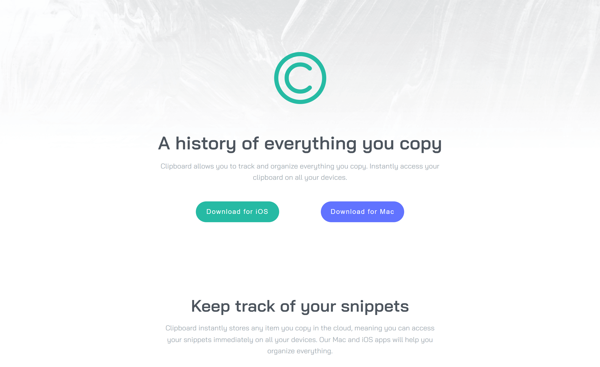

# Frontend Mentor - Clipboard landing page solution

This is a solution to the [Clipboard landing page challenge on Frontend Mentor](https://www.frontendmentor.io/challenges/clipboard-landing-page-5cc9bccd6c4c91111378ecb9). Frontend Mentor challenges help you improve your coding skills by building realistic projects. 

## Table of contents

- [Overview](#overview)
  - [Screenshot](#screenshot)
  - [Links](#links)
- [My process](#my-process)
  - [Built with](#built-with)
- [Author](#author)

## Overview

### Screenshot

### Links

- Live Site URL: (https://celadon-snickerdoodle-4e407d.netlify.app)

## My process

### Built with

- Semantic HTML5 markup
- CSS
- Flexbox
- Mobile-first workflow

## Author

- Website - [Gastón Recalde](https://gaston-recalde-portafolio.netlify.app)
- Frontend Mentor - [@Gaston-Recalde](https://www.frontendmentor.io/profile/Gaston-Recalde)
- Twitter - [@OsoRecalde](https://twitter.com/OsoRecalde)